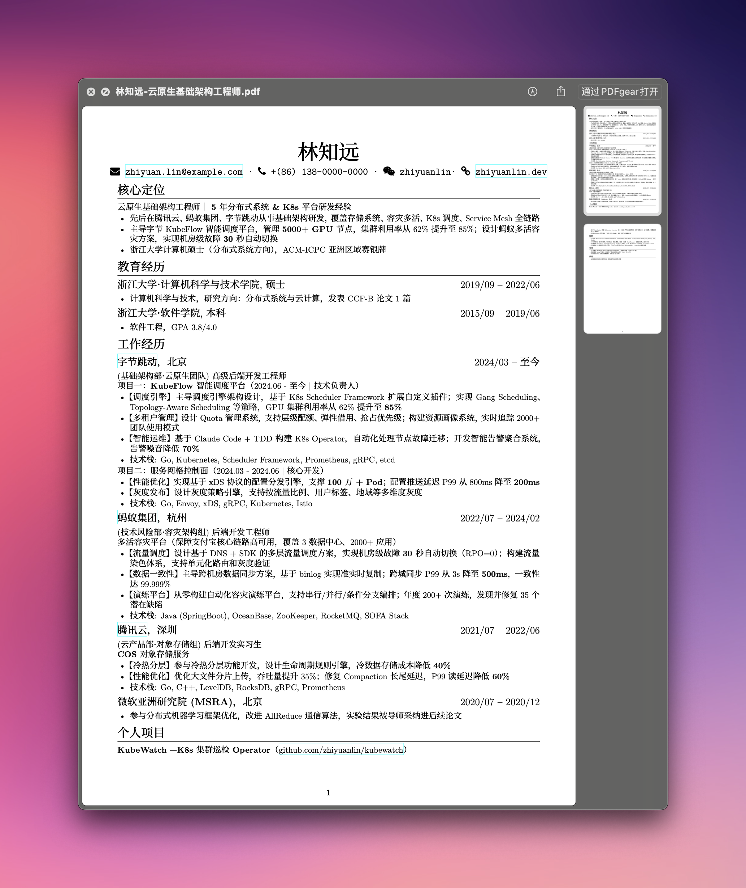

# claude-resume

English | [中文](README.zh-CN.md)

Claude Code skill that generates tailored LaTeX résumés from structured experience data — one source, many resumes.

> Not just another skill — a reference project showing how to build a complete workflow with Claude Code Skills.

<p align="center">
  
</p>

---

## How It Works

```
┌─────────────────────────────────────────────────────────┐
│  Onboarding (/resume init)                              │
│                                                         │
│  Paste resume  ──→  auto-parse  ──→  experiences/*.md   │
│       or                                                │
│  Q&A guided    ──→  step by step ──→  experiences/*.md  │
└──────────────────────────┬──────────────────────────────┘
                           │
                           ▼
┌─────────────────────────────────────────────────────────┐
│  Generate (/resume generate "Backend Engineer")         │
│                                                         │
│  read experiences  →  analyze JD  →  tailor & reframe   │
│                                                         │
│  → resume.tex  →  make en  →  output/Name-Title.pdf     │
└─────────────────────────────────────────────────────────┘
                           │
                           ▼
┌─────────────────────────────────────────────────────────┐
│  Maintain (/resume add)                                 │
│                                                         │
│  "Got promoted" / "New project" / "Got certified"       │
│  → auto-update experiences/*.md                         │
└─────────────────────────────────────────────────────────┘
```

The same work experience gets different framing depending on the target role. A cloud platform project emphasizes architecture design for infra roles, but highlights workflow orchestration for AI Agent roles.

## Features

- **Zero-config onboarding** — paste an existing resume or answer a few questions; no manual Markdown editing required
- **Experience-driven** — work history, skills, and honors stored as Markdown; presentation is separate from data
- **AI-powered tailoring** — auto-selects experiences, adjusts bullet points, reorders priorities based on JD
- **Multi-role adaptation** — same experience, different angles (backend / cloud-native / AI / fullstack)
- **Natural language maintenance** — add new experiences, skills, or certifications by just telling Claude
- **LaTeX output** — professional typesetting via XeLaTeX, based on [billryan/resume](https://github.com/billryan/resume)
- **Version tracking** — `.history/` auto-backup before each generation

## Prerequisites

- **Claude Code CLI** — installed and authenticated
- **XeLaTeX** — `brew install --cask mactex` on macOS ([download](https://tug.org/mactex/))

## Quick Start

### 1. Install

**Option A: Install as a Skill (recommended)**

```bash
npx skills add deusyu/claude-resume --yes
```

Then in any directory:

```
/resume init
```

The skill auto-scaffolds the project structure (copies `resume.cls`, `Makefile`, creates `experiences/` directories).

**Option B: Clone the repo**

```bash
git clone https://github.com/deusyu/claude-resume.git
cd claude-resume
claude
```

### 2. Onboarding — initialize your experience data

**Guided setup (recommended for first-time users)**

```
/resume init
```

The skill walks you through a Q&A — name, education, work history, projects, skills — one question at a time.

**Import from existing resume**

```
/resume init <paste your resume text here>
```

The skill parses and structures it into the right format automatically.

### 3. Generate a resume

```
/resume generate Backend Engineer
```

Or point to a JD file:

```
/resume generate jobs/bytedance-backend.md
```

The skill shows a tailoring plan (what to include, what to cut, how to reframe) and asks for confirmation before generating.

### 4. Keep it updated

```
/resume add Led a new project building a real-time data pipeline, processing 1M events/sec
/resume add Got AWS Solutions Architect Professional certification
```

## Project Structure

| Path | Purpose |
|------|---------|
| `skills/resume/SKILL.md` | Skill definition — all workflows (init, generate, add) |
| `skills/resume/assets/` | Bundled assets (resume.cls, Makefile, templates) |
| `skills/resume/references/` | LaTeX command reference |
| `experiences/` | Structured experience data (source of truth) |
| `jobs/_template.md` | Template for job description input |
| `resume.tex` | Current active LaTeX source |
| `resume.cls` | LaTeX class (layout, fonts, commands) |
| `Makefile` | Build commands (`make en`, `make zh`, `make all`, `make clean`) |
| `.history/` | Auto-backup of previous `.tex` versions |
| `output/` | Generated PDF output directory |

## Subcommands

### `/resume init [optional: paste resume text]`

Onboarding. Two modes:

- **No arguments** → guided Q&A, one question at a time (name → education → work → projects → skills → honors)
- **With text** → parses your existing resume or LinkedIn export into structured `experiences/` files

### `/resume generate [job title or JD file path]`

The core workflow. Full pipeline:

1. **Read** all experience files from `experiences/`
2. **Analyze** job requirements — extract key skills, priorities
3. **Plan** — select experiences, decide ordering and emphasis, choose which sections to include/omit
4. **Confirm** — show the plan to user, wait for approval
5. **Generate** — write tailored `resume.tex` using `resume.cls` commands
6. **Build** — `make en` → copy PDF to `output/`

### `/resume add [description]`

Natural language interface to update experience files:

```
/resume add Built an open-source RAG project with LlamaIndex, got 200+ stars
/resume add Got AWS Solutions Architect certification
```

## Customization

### Experience file format

Work history files use YAML frontmatter + Markdown:

```markdown
---
company: Company Name
period: 2024/01 -- Present
department: Engineering
role: Senior Backend Engineer
tags: [go, kubernetes, distributed-system]
---

# Project Name
> Timeline | Role

## Background
...

## Key Work
...

## Metrics
...

## Tech Stack
...
```

The `tags` field helps the AI match experiences to job requirements during generation.

### LaTeX style

Modify `resume.cls` to customize layout, fonts, and spacing. Currently based on [billryan/resume](https://github.com/billryan/resume).

## Credits

- LaTeX template based on [billryan/resume](https://github.com/billryan/resume) and [imtsuki/resume](https://github.com/imtsuki/resume)
- Résumé generation powered by [Claude Code](https://claude.ai/code) Skills

## License

[MIT](LICENSE)
